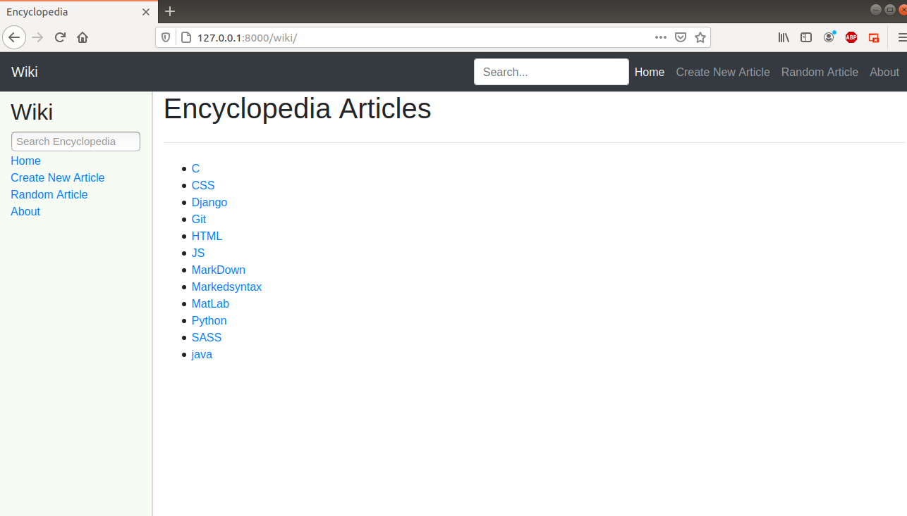
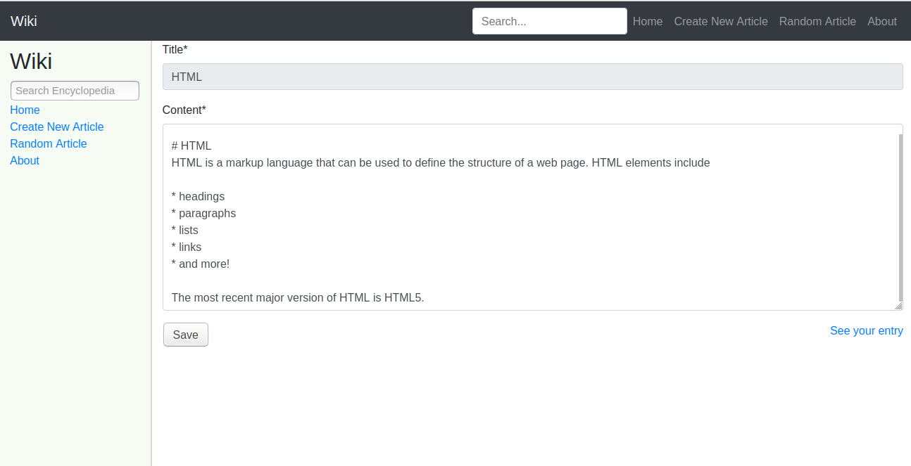

# wikiProject

This Wiki project is an implementation of the assignment of CS50’s Web Programming with Python and JavaScript course introduced by Harvard univesity.
For more information please see: [Wiki Project](https://cs50.harvard.edu/web/2020/projects/1/wiki/).

## Project Explanation:

This project creates an encyclopedia that consists of a number of encyclopedia entries on various topics.

The homepage lists  all the topics in the encyclopedia. The user can click on any topic to see the article content.

**Encyclopedia allows the user:**

- To create new article or edit an existing one.

In both create and edit form, the user will be able to write MarkDown text and when he clicks save in Edit form or Create in create form
the content will be rendered to HTML and the article will be saved.

- To explore a random article from the encyclopedia entries.

- To search for a spesific article:
    - If the user write the correct name of the article in the search form, he will
    be taken to the content of this article.
   - Otherwise, a list of all the entries' name that match the query string will
    be shown.

